# Saily App — UI/UX Redesign (Flutter)

A Flutter-based redesign of the **Saily eSIM app's onboarding flow and Home Screen**,
built as a UI/UX case study focused on clarity, visual hierarchy, and user experience.

<br>

📋 [What I changed & why](#-design-decisions) &nbsp;&nbsp;|&nbsp;&nbsp; 🚀 [Setup & run](#-setup--run)

---

## 📋 Design Decisions

### What I Observed (Original App)

The original onboarding puts everything on a single screen — hero image, tagline, four bullet
points, and two CTAs all at once. The Home Screen had a similar problem: new users landed with
no context, and active users couldn't quickly find data usage, plan status, or security info.

**Key issues:**
- Information overload with no guided narrative
- Two CTAs on one screen creates immediate decision pressure
- Generic layout that doesn't reflect a modern travel product
- Home Screen adapts poorly between new and active user states

---

### What I Changed & Why

#### Onboarding

| | Original | Redesign |
|---|---|---|
| Structure | Single screen | 3 paginated screens |
| Navigation | Two CTAs upfront | Next → Get Started on final page |
| Visuals | Circular photo with logo overlay | Unique illustration per page |
| Content | 4 bullet points at once | One focused message per screen |

Each page builds on the last — introducing the product, building confidence, then converting.
This narrative arc earns each tap rather than demanding a decision upfront.

---

#### Home Screen

| | Original | Redesign |
|---|---|---|
| New user state | Near-empty with a single "Buy Plan" button | Friendly empty state with clear guided CTA |
| Active plan header | Raw MB count + "Add Data" | Region, GB remaining, progress bar, inline add-ons |
| eSIM section | Not present | Scrollable cards with plan name, flag, active status |
| "For You" section | Same cards for all users | Personalized based on activity and active plans |
| Security section | Small On/Off icon tiles | "Protected" / "At Risk" status card with toggles |

---

### Color System

| Role | Original | Redesign |
|---|---|---|
| Primary / Header | Light blue | Deep purple `#7C3AED` |
| CTA Button | Yellow | Purple `#7C3AED` |
| Background | White | White |
| Security — Safe | — | Green `#2ECC71` |
| Security — At Risk | — | Red `#E53935` |

The shift from blue/yellow to a deep purple system makes the app feel more premium and
tech-forward — closer to a connectivity tool than a travel lifestyle brand. Red and green
are reserved exclusively for security states, following system UI conventions users already know.

#### Onboarding Colors & Illustrations

| Page | Background | Illustration |
|---|---|---|
| Stay Connected Anywhere | Yellow `#FFD700` | Astronaut in a flying saucer |
| Travel Without Limits | Lavender `#C9BEFF` | Backpacker climbing |
| Internet, Ready When You Land | Orange `#FF5F00` | Person happily on their phone |

Each page has a distinct full-bleed background color, building visual momentum across the flow.
All illustrations share a consistent **retro cartoon style** — bold outlines, flat colors,
subtle grain — keeping the tone playful and universally relatable.

The opening screen intentionally keeps Saily's signature yellow, creating a smooth brand
handoff before transitioning into the redesigned purple Home Screen.

---

### Design Principles

| Principle | Application |
|---|---|
| Progressive disclosure | Information revealed gradually, not all at once |
| One idea per screen | Each onboarding page carries a single message |
| Visual storytelling | Illustrations give each page a distinct personality |
| Context-aware UI | Home screen adapts between new and active user states |
| Clear empty states | Every screen tells the user what to do next |
| Single CTA per view | One action at a time removes decision pressure |

---

## 📸 Screenshots

### Onboarding

**Original**
<p>
  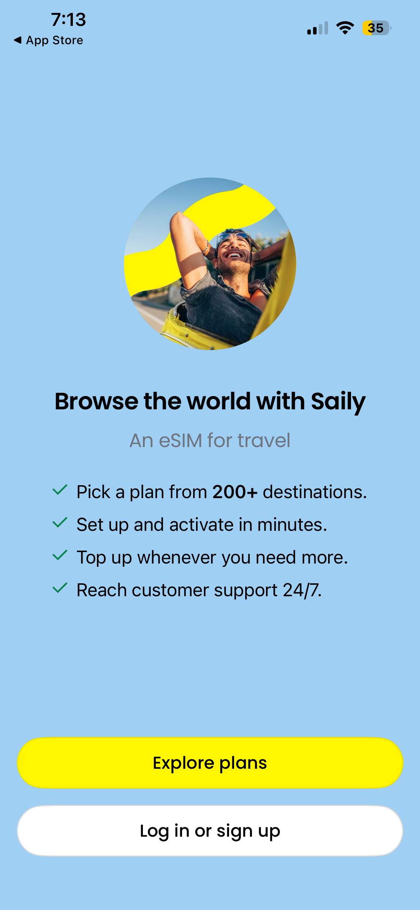
</p>

**Redesign**
<p>
  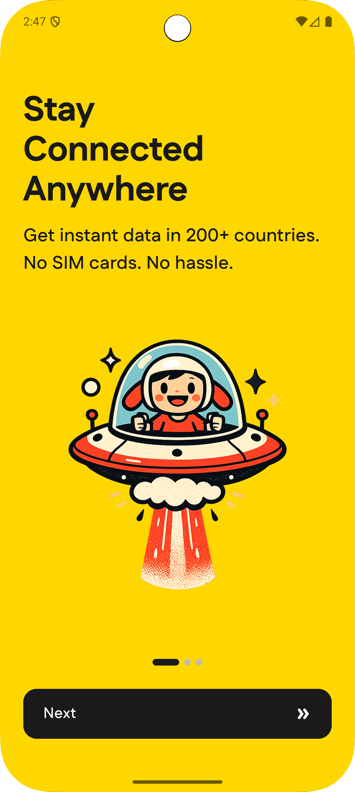
  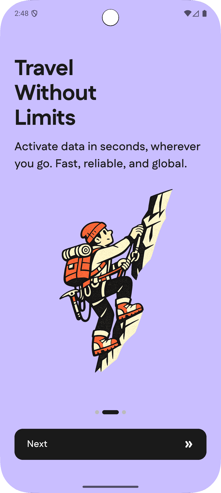
  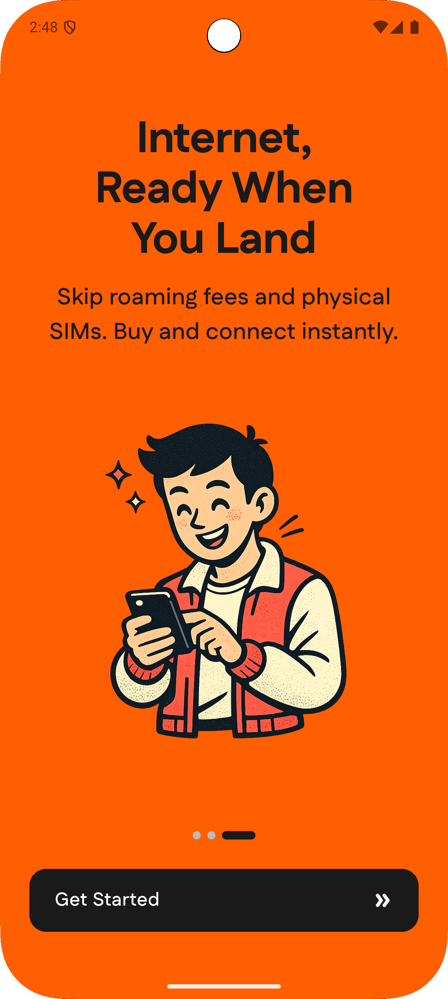
</p>

### Home Screen

**Original**
<p>
  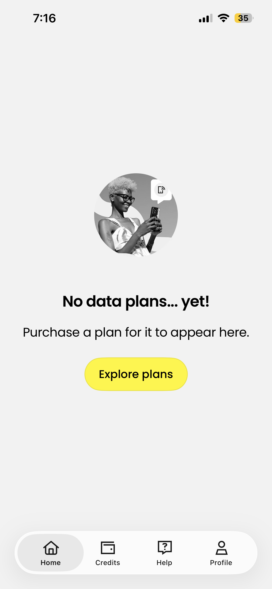
  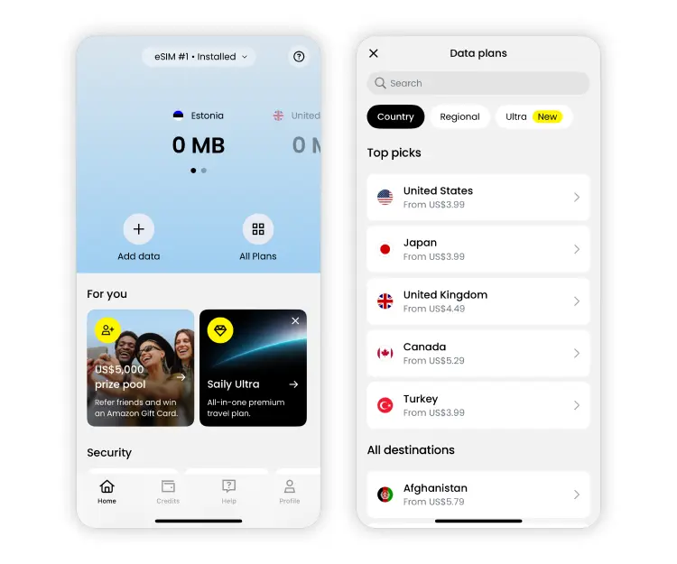
  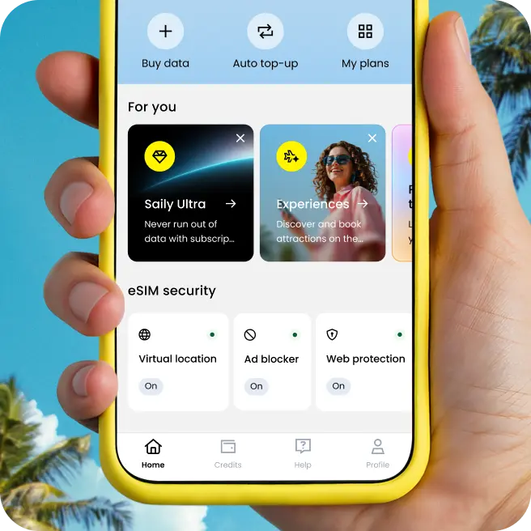
</p>

**Redesign**
<p>
  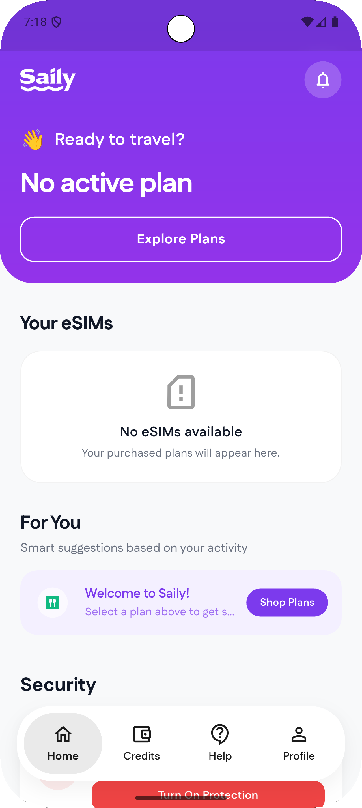
  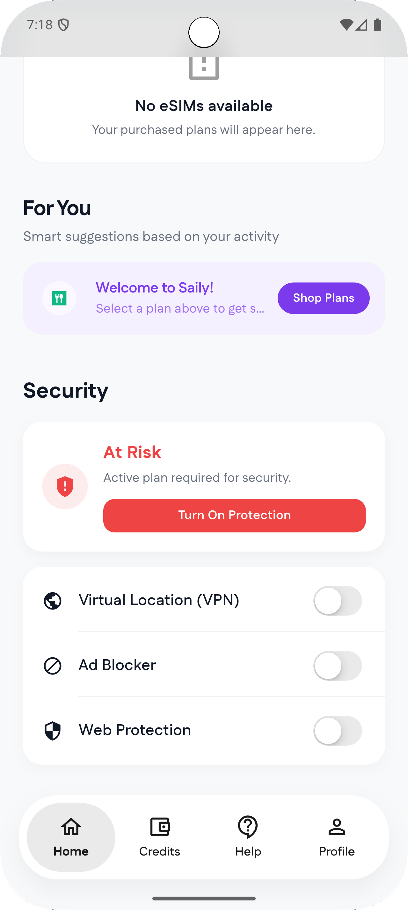
  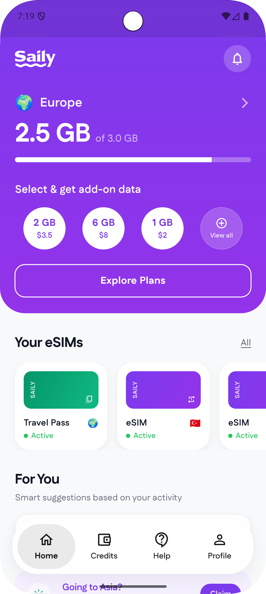
  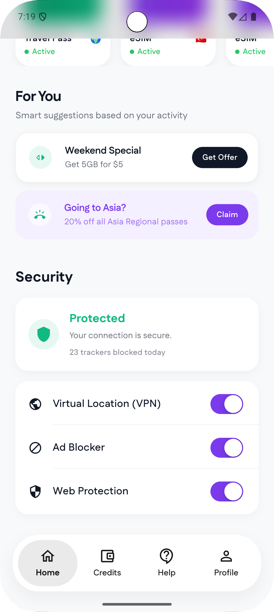
</p>

### Rough Wireframes

<p>
  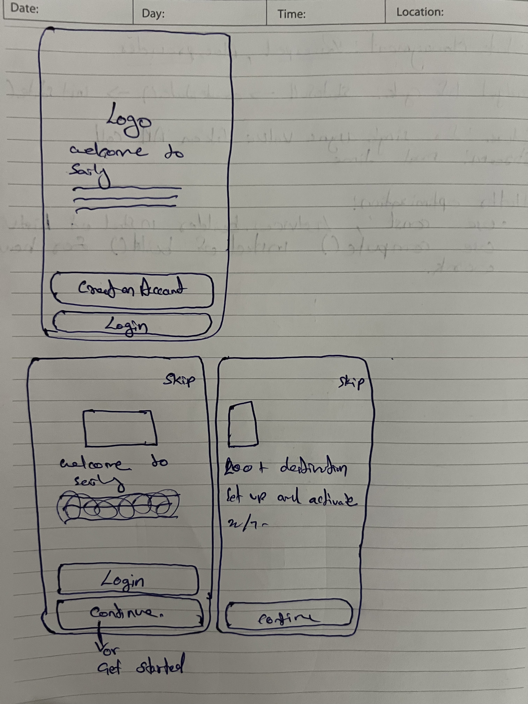
  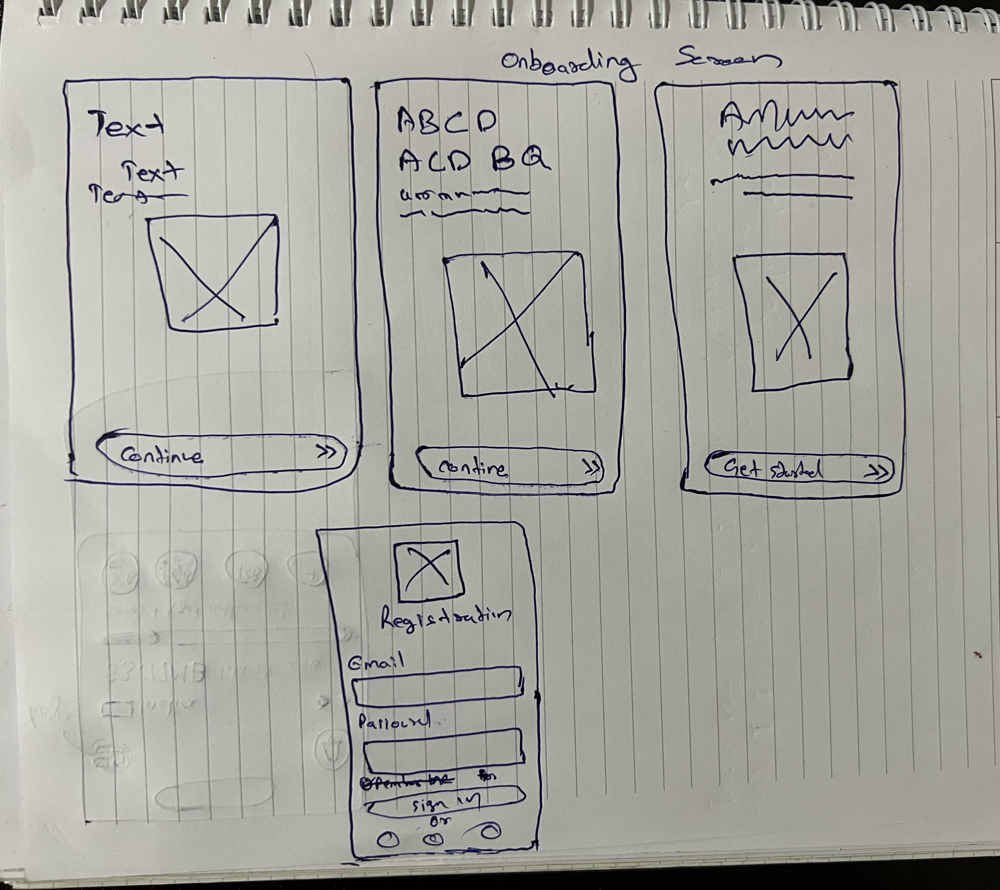
  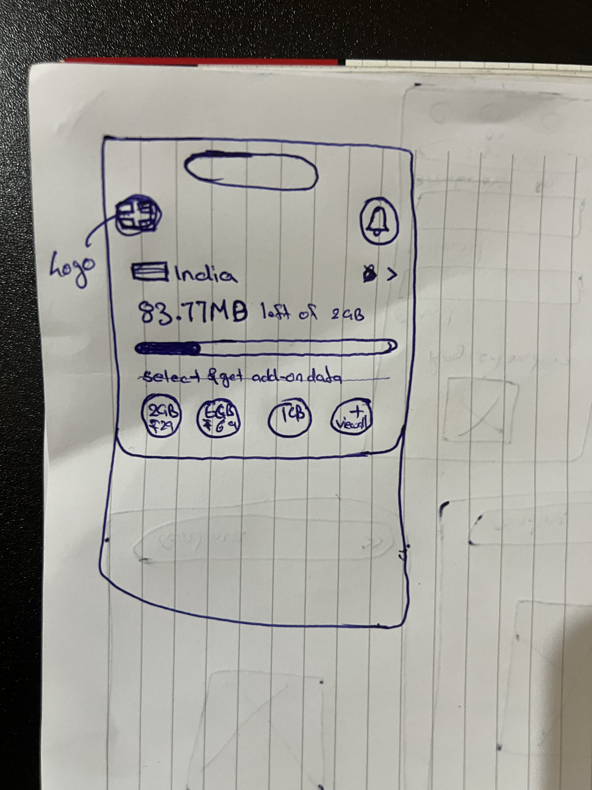
</p>

## 📱Demo

https://github.com/user-attachments/assets/14e2c36f-de91-455d-8de4-35de81f97824

---

## 🚀 Setup & Run

### Prerequisites

- [Flutter](https://docs.flutter.dev/get-started/install) 3.x (stable)
- Dart SDK (included with Flutter)
- Android Studio / Xcode / VS Code

### Getting Started

1. **Clone the repository**
```bash
   git clone https://github.com/risal-ea/saily_app.git
   cd saily_app
```

2. **Install dependencies**
```bash
   flutter pub get
```

3. **Run the app**
```bash
   flutter run
```

> Make sure a simulator/emulator is running or a physical device is connected.

### Build
```bash
# Android
flutter build apk

# iOS
flutter build ios
```
